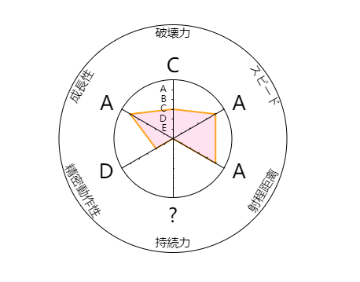

[目录](#目录)
- [出身](#出身)
- [魔音教](#魔音教)
- [天音宗](#天音宗)
- [功法](#功法)
  - [兰亭序](#兰亭序)
  - [反方向的钟](#反方向的钟)
- [武器（乐器）](#武器乐器)
  - [武器属性](#武器属性)
- [互动](#互动)
- [门派](#门派)
- [铸剑山庄](#铸剑山庄)

## 出身
玩家出身时选择自己的初始偏向，魔教——中立——正义  

基础属性[设定](http://59.110.20.14/jojo)  
攻击力 C
混乱 S
防御力 A
逃生 S
成长 A  
  

 
## 魔音教
转职门派属性 （更加容易随机到偏向精神扰乱鬼哭狼嚎）

## 天音宗
转职门派属性 （更加容易随机偏向正常唱歌利用歌声征服敌人）

## 功法

参考功法[电视剧和小说中一些音乐攻击](https://www.sohu.com/a/295833997_609772)

一些乐谱效果  

### 兰亭序
要求乐器为民族属性乐器，效果是当陷入战斗绝境是，领悟绝处逢生，逃跑能力增加k， k由玩家对手决定，如果对手被你的歌喉征服，最大可以提升3点+蹂点点数

### 反方向的钟
要求声名显赫，要求武器为流行乐器，技能发动效果，临时回到当初并随机获得，并随机丢失

## 武器（乐器）
### 武器属性   

| 民族乐器 | 流行乐器 | 摇滚乐器 | 乐器属性 | 类型属性 |
| :-------- | :-------- | :-------- | :------------ | :------------ |
| 笛子   |          |          | 悠长增加时间 | 增益戏曲曲谱 |
|          | 钢琴   |          | 清脆增加次数 | 增益流行曲谱 |
|          |          | 架子鼓 | 节奏增加分割 | 增益节奏曲谱 |

## 互动
当参与华山论剑时，可以选择出场  
出场发动需要唱一首歌  
- 鬼哭狼嚎，越难听越容易被集火，但可以获得***
- 好听的歌，获得玩家好感，增加防御力***
- 装逼，褒贬不一，可以选择一个属性增加***

## 门派
被动可以修习其他门派初级内息，但是不能学习其他任何功法并且只能携带音乐类

## 铸剑山庄
你可以找寻铸剑山庄的玩家帮助打造乐器，但是消耗不同类型的材料

- 民族类 ***
- 流行类 ***
- 摇滚类 ***