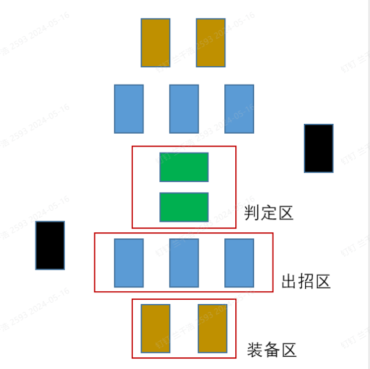

## 思路整理
//开放地图Roglike类DND桌游。玩家在自由地图上扮演一位初入江湖的少侠，拥有自己的独特天赋与功法，可以在地图中通过抉择事件成长，还可以构筑卡组相互战斗，最终声名鹤立的那位将获得游戏胜利//

## 背包思路1.0：               
1.取消灵力，灵力由卡牌上限代替。     

2.取消武力，武力由武学卡牌牌面战力和代替。       
例：抽取事件卡——[遭遇盗贼]，如果背包内武学卡战力和大于30，判断成功。               

3.卡牌上限通过心法或者道具增加。        
例：[武当基础心法]——1阶心法，占用2，背包上限加1；两个回合后，再获得一张武当心法 ；       
消耗3张武当基础心法+1张武学卡，获得[绕指剑法] / 消耗3张武当基础心法+1张心法卡，获得[太极功]   
[太极功]——2阶心法，占用1，背包上限加1；消耗2张[太极功]+1张2阶心法，获得[纯阳无极功]

3.卡牌进阶
复数量卡牌可以按公式吞噬进阶，释放卡位同时提供更强的效果————by 云顶之弈      

##  交互
1.武学卡牌战斗，战斗基础逻辑猜拳+比大小           
2.武学卡共两种属性，[战斗属性]和[响应]；      
[战斗属性]：长兵、短兵、拳脚（长兵＞短兵＞拳脚＞长兵）         
3.战斗流程：    
准备阶段：双方抽牌。            
开始阶段：双方放置1张或0张盖牌在判定区，放置任意数量的盖牌在出招区。                
出招阶段：同时打开判定区盖牌，根据属性判定当前劣势方；判定区无牌方自动进入劣势，双方均无牌，结束决斗，比较总战力和，高者视为决斗获胜。              
拆招阶段：劣势方先操作，首先打开心法牌，心法牌按牌面标记在本次战斗中提供内力，劣势方消耗内力，打开盖牌发动响应效果。               
结算阶段：劣势方若无法响应，扣血然后结算场面效果，进入准备阶段。              
4.[出招]:双方打开盖牌，比较战斗属性，被压制的玩家处于[劣势]。        
补充规则1：若起手中双方首张牌属性相同，双方玩家[平势]，双方[抽牌]，进行下次[出招]。          
补充规则2：起手使用的牌进入弃牌堆。          
战斗例：TBD                
5.[响应]：按牌面描述进行响应————by 游戏王连锁     
牌例——绕指剑法          
战力5；消费2响应：若对手丢弃一张战力更高于此卡的牌，我方劣势，否则对方劣势；  

## 战斗场地

